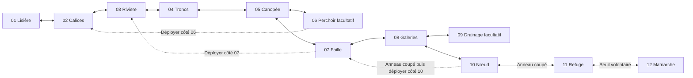

# Berceau Enfoui — topologie et simulation indépendante V37

## Statut exact

`app/game/systems/buriedCradle.ts` fournit les douze salles, les collisions, les portes, les raccourcis, les interactions, la persistance locale et une simulation complète de la Matriarche. Le module est pur : aucun navigateur, aucun fichier d’art, aucune mutation d’un registre global.

**Ce module n’est pas raccordé à HuntCanvas, GameClient ni SaveGame. Il ne constitue donc pas encore un niveau livré dans l’interface de jeu.** Les tests exécutent le déplacement et le combat, pas un rendu de production. Les modèles de collisions de `platformCollision.ts` et les valeurs physiques d’Expédition sont réutilisés ; l’accélération, les combos, les équipements, la caméra, les sons et les ennemis ordinaires d’Expédition ne sont pas reproduits ici.

Aucune nouvelle image n’a été générée dans ce lot. Aucun atlas de douze tableaux concaténés n’est ajouté. L’annonce de 85 sprites dans la conversation source est un inventaire annoncé, pas une couverture d’art importée par ce module.

## Sources et arbitrages

- Conversation **Secteur reine alien**, `6aa9e19e-0604-83ed-890a-68ad704e932f`, archivée dans `work/v36/new-world-specs/queen-thread-page-1.json`.
- Postulat utilisateur du tour `44c763fa-5928-4ab1-81c5-7a5e14dc26ed` : secteur Xeno Prime, tête géante de Reine au sol, tentacules géants, dernier tableau consacré au boss.
- Proposition détaillée de la conversation : noms des douze tableaux, trajet principal, branches 06/09, raccourcis 06→02 / 07→03 / 10→07, drainage facultatif, appuis permanents, trois phases anatomiques, transformation locale après victoire.
- Les annexes téléchargeables annoncées par références opaques n’étaient pas incluses dans ce fichier JSON. **Les dimensions et coordonnées ci-dessous sont une adaptation d’intégration, pas une transcription d’emprises d’images ou d’un dossier annexe récupéré.**

La Matriarche enracinée est l’interprétation originale demandée pour ce jeu. Le module n’affirme pas que cette mutation ou Xeno Prime constituent une espèce ou une planète d’origine canoniques.

Les points suivants sont des choix d’implémentation explicites : dégâts/chiffres, positions exactes, cadre de salle de 720 px, deux flaques fixes, cycle déterministe d’attaques, verrou physique du tableau 10 et réinitialisation des blessures du boss après KO. La source impose la conservation des blessures **entre ouvertures** ; elle ne fournit pas ici de règle explicite de conservation de ces blessures après une mort/reprise. Les raccourcis, la valve, la racine coupée, la victoire et le trophée restent persistants.

## Graphe, pas bande de douze écrans



Les arêtes pointillées deviennent réversibles après leur première activation. Aucun raccourci ni drainage n’est nécessaire pour parvenir au boss. Le verrou 10 se résout **dans 10**, sans objet provenant de 11/12. La porte 11→12 se franchit par interaction ; le retour temporairement fermé pendant le combat est rétabli par la victoire. Un KO replace le joueur au dernier refuge, hors de ce verrou.

Chaque salle possède son espace local, ses modules de sol, ses plateformes et ses extrémités de portes. `mapCell` sert uniquement à la carte : ne pas l’ajouter aux coordonnées de collision. Un moteur de streaming doit charger la nouvelle salle lorsque `room-entered` est émis, avec le joueur déjà positionné au débouché opposé.

## Géométrie et conventions

Toutes les coordonnées du joueur sont son **coin supérieur gauche**, comme dans HuntCanvas. Les débouchés de portes et les repères `mainRoute` désignent **centre X / pieds Y**. Pour poser un acteur : `x = feet.x - 36`, `y = feet.y - 116`.

- Joueur : 72×116 px ; vitesse de référence 300 px/s.
- Gravité : 1 850 px/s² ; saut : −720 px/s, importé depuis `jumpAssist.ts`.
- Sol : Y=624 ; hauteur d’espace local : 720 ; le bord supérieur retient le corps entier à Y≥0, même lors d’un saut depuis le dernier palier.
- Les marches obligatoires de l’ascension 04 gagnent chacune 104 px. Elles fonctionnent sans double saut, grappin, énergie ou équipement.
- Le socle continu est découpé en modules solides de 256×96 maximum. Les branches, racines pétrifiées et appuis intermédiaires sont des modules traversables par-dessous. Les plafonds souterrains et le verrou de 10 sont solides.
- Les plateformes pétrifiées ne sont jamais détruites. Couper la racine de 10 retire uniquement le verrou vertical. Vaincre la Matriarche **ajoute** un pont de tentacule inerte en 03.

Le socle permet le retour et évite les fosses irréversibles ; il n’active pas les portes en hauteur. Marcher sous les paliers de 04 ne permet pas de quitter 04. Marcher au sol sous 05 ne permet pas d’ouvrir 05→07. Les paliers de récupération de 05 permettent cependant de remonter après une chute.

| Salle | Largeur | Couche | Géométrie déterminante |
|---|---:|---|---|
| 01 | 1536 | Surface | Corniche optionnelle, refuge initial |
| 02 | 1792 | Surface | Voie au sol sous les racines, contreforts à Y=528/424 |
| 03 | 1792 | Surface | Appuis à Y=552/520, accès du raccourci à Y=472 |
| 04 | 1792 | Canopée | Paliers Y=520,416,312,208 ; sortie obligatoire à Y=208 |
| 05 | 1792 | Canopée | Haute voie à Y=416, récupération à Y=520 |
| 06 | 1280 | Canopée | Observatoire et pont permanent à Y=416 |
| 07 | 1792 | Sous-sol | Descente réversible Y=312,416,520,624 ; évent local |
| 08 | 1792 | Sous-sol | Rebord bas/haut, acide autonome, branche vers 09 |
| 09 | 1536 | Sous-sol | Rebord de dérivation et valve aux pieds (1408,624) |
| 10 | 1792 | Sous-sol | Appât de perforation ; verrou x=1568, y=288, 32×336 |
| 11 | 1280 | Sous-sol | Refuge final et seuil volontaire |
| 12 | 1920 | Bassin | Socle continu, trois appuis bas et sortie derrière la joue |

Coordonnées exactes des portes, en positions de pieds :

| Porte | Extrémité A | Extrémité B | Condition |
|---|---|---|---|
| 01-02 | 01 (1440,624) | 02 (96,624) | Libre |
| 02-03 | 02 (1696,624) | 03 (96,624) | Libre |
| 03-04 | 03 (1696,624) | 04 (96,624) | Libre |
| 04-05 | 04 (1520,208) | 05 (96,416) | Ascension physique de 04 |
| 05-07 | 05 (1696,416) | 07 (96,312) | Haute voie de 05 |
| 05-06 | 05 (880,416) | 06 (1184,416) | Branche facultative |
| 07-08 | 07 (1696,624) | 08 (96,624) | Libre |
| 08-09 | 08 (880,624) | 09 (96,624) | Branche facultative |
| 08-10 | 08 (1696,624) | 10 (96,624) | Libre |
| 10-11 | 10 (1696,624) | 11 (96,624) | Anneau de 10 coupé |
| 11-12 | 11 (1184,624) | 12 (96,624) | Retour fermé pendant la tentative |
| 06-02 | 06 (96,416) | 02 (1056,424) | Déploiement depuis A |
| 07-03 | 07 (480,416) | 03 (1440,472) | Déploiement depuis A |
| 10-07 | 10 (320,624) | 07 (1216,520) | Anneau coupé + déploiement depuis A |

La proximité d’interaction est de 84 px horizontalement et 42 px verticalement par rapport aux pieds du joueur. Tous les débouchés sont testés sur un véritable appui et hors d’une collision solide.

## Combat, drainage et état du monde

Dans 10, entrer dans la bande de basalte déclenche un avertissement de perforation. Sortir de la marque pendant 1,2 seconde laisse le tentacule coincé ; son anneau est accessible pendant 3,8 secondes. Une attaque normale le coupe. Si le joueur reste dans la marque, l’ouverture n’est pas accordée ; le cycle recommence, sans ressource à consommer.

Dans 12, `CRADLE_BOSS_HEAD` occupe (1010,120), 880×504. La tête reste couchée ; le module ne lui attribue ni saut, ni vol, ni déplacement hors du bassin. Cette emprise de présentation n’est pas un grand bloc de collision qui engloutirait le joueur ou empêcherait les attaques sous la mâchoire.

Les trois appuis bas sont à (320,552), (840,528) et (1360,552), chacun large de 240 px. Le troisième est le replat de mâchoire. Les points faibles de gaine et de bulbe sont à (1550,474), 56×72 ; ils sont frappables avec une portée ordinaire de 100 px depuis le replat.

1. **Tentacules** : deux moteurs de 60 PV. Une perforation ratée expose l’anneau du moteur encore vivant à la position visée. Un moteur coupé reste à zéro pour toute la tentative.
2. **Gaine** : deux pans de 60 PV. Le souffle bas se termine par une ouverture de quatre secondes sous la joue. Le joueur peut s’abriter sur les appuis ou dans le refuge à gauche.
3. **Bulbe** : 100 PV. Une morsure ratée expose le bulbe pendant cinq secondes. Les attaques alternent aussi balayage, onde au sol et convergence des fouets ; une morsure d’ouverture revient régulièrement.

La simulation emploie une attaque ordinaire de 20 dégâts, portée 100 px, cadence minimale 0,55 s. Sa boîte reprend le bord avant et l’inset vertical de l’attaque légère de `huntMeleeCombat.ts`. Cette cadence simple sert au contrat de traversabilité/combat ; elle ne remplace pas les combos du jeu lors du raccordement.

Les attaques exposent leurs rectangles via `getCradleBossAttackRects` ; le renderer doit lire `boss.stage` pour afficher un avertissement en `telegraph`, des dégâts en `active`, puis le point faible fourni en `opening`. Les huit familles prévues ont un cycle : perforation, balayage, capture, salve, souffle, morsure, onde et fouets. La capture peut être coupée par la même attaque ordinaire pendant son avertissement.

Le drainage 09 réduit la durée effective des flaques de **8 à 3 secondes**. Les deux poches sont limitées à x=640…784 et x=1120…1264. Elles ne condamnent ni le refuge gauche, ni les trois supports, ni l’approche sèche de la mâchoire. Elles ne forment jamais un mur de collision. Le trajet complet et la victoire sont testés sans drainage.

Après la victoire :

- La tête reste en 12 ; seul le fragment de couronne peut être pris, aux pieds (1656,624).
- La sortie derrière la joue est aux pieds (1824,624).
- Le tentacule de rivière devient un pont ; les évents contrôlés se calment ; l’état des membranes devient relâché.
- **La forêt, les xénomorphes autonomes et l’acide autonome des galeries restent présents.** Seul le centre de contrôle de ce bassin est vaincu.

## API et raccordement ultérieur

```ts
const saved = parseBuriedCradleProgress(rawSavedValue);
// Si saved === null, garder la sauvegarde d'origine et afficher une erreur.
// Ne pas convertir ce résultat en une nouvelle partie silencieuse.
let run = createBuriedCradleRun(); // ou createBuriedCradleRun(saved)

const step = stepBuriedCradle(run, {
  move: 1,                 // -1, 0 ou +1
  jumpPressed: false,       // front d'appui, pas l'état maintenu
  jumpHeld: true,
  meleePressed: false,      // front d'appui
  interactPressed: false,  // front d'appui
}, 1 / 60);
run = step.run;

const room = buriedCradleRoom(run.roomId);
const platforms = getBuriedCradlePlatforms(run.roomId, run.progress);
const weakPoint = getCradleWeakPoint(run);
const localHazards = getCradleEnvironmentHazards(run);
const worldCondition = getCradleWorldCondition(run.progress);
// Dessiner, traiter step.events, et enregistrer seulement run.progress.
```

Les étapes de plus de 0,25 seconde sont rejetées. Les étapes acceptées sont subdivisées à 1/60 s maximum ; les événements d’appui ne sont appliqués qu’une fois. Pour la reprise après suspension, utiliser une horloge plafonnée dans l’hôte, pas une simulation de toutes les secondes écoulées.

`BuriedCradleProgress` conserve les visites, raccourcis, refuge, valve, anneau de 10, victoire et trophée. Les refuges sont 01, 07 et 11. Les données de version inconnue, les formes invalides, les identifiants inconnus et les contradictions de progression sont rejetés. Ce nouveau contrat n’ajoute ni ne modifie un champ de `SaveGame` ; le branchement avec une migration de sauvegarde reste à faire.

Événements : `door-locked`, `shortcut-opened`, `room-entered`, `drainage-opened`, `root-cut`, `part-cut`, `boss-phase`, `hurt`, `knockout`, `crown-claimed`, `extracted`.

Lors de l’intégration, les sprites doivent rester indépendants : décor par couche, support/collision distinct de son dessin, corps de tête distinct de ses tentacules et de leurs nerfs, gaine et bulbe séparés, flaques séparées. Le module ne dessine pas de rectangle de remplacement comme s’il s’agissait d’un sprite final. La parallaxe, le recul de caméra d’introduction, les éléments d’observatoire et les animations de transformation nécessitent encore un rendu et des actifs vérifiés.

## Vérification

`node --experimental-strip-types --test tests/buriedCradle.test.ts`

Les tests couvrent le trajet **01→02→03→04→05→07→08→10→11→12→victoire→couronne→extraction** par déplacements, sauts, appâts et frappes, sans téléportation dans ce test, sans 06/09, sans raccourci et sans KO. Ils couvrent aussi les trois raccourcis avec approches physiques dans les deux sens, le retour de faille, la récupération après chute de canopée, l’impossibilité de valider les portes élevées au sol, les spawns, le verrou solide, 32 combinaisons d’état pour la conservation des appuis, les phases du boss, le drainage, le KO, la victoire locale et les sauvegardes invalides.

Ce résultat prouve le contrat de simulation autonome. Il ne prouve pas encore une expérience jouable dans l’interface, le raccordement des collisions avec les sprites source, une caméra lisible à toutes résolutions ou une validation manuelle du rendu de la Matriarche.
