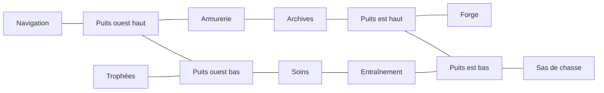

# V21 — Le vaisseau comme niveau de préparation

Le pont est un lieu traversable de 4 000 × 1 500 unités. Les huit installations restent les fonctions réelles du jeu ; le niveau leur donne une salle, une entrée et un trajet physique. Aucune salle ne téléporte le joueur. Les images décorent les surfaces mais ne fournissent ni les collisions ni les accès.

## Topologie

Deux coursives relient quatre salles par étage. Deux puits relient les étages : le puits de navigation à x = 1 060 et le puits du sas à x = 2 980. Le sol haut est à y = 700, le sol bas à y = 1 360. Les couloirs ont 180 unités de hauteur ; les salles ont des plafonds différents et des volumes plus larges.



Le joueur arrive au sas, à (3 500, 1 360), tourné vers les installations. Le puits oriental offre un retour court depuis l’arsenal et la forge. La boucle complète rejoint toutes les installations puis revient au sas ; les pièces de préparation ne nécessitent aucun saut obligatoire.

| Salle / station | Rectangle x, y, largeur, hauteur | Station |
| --- | --- | --- |
| Navigation | 120, 160, 760, 540 | 500, 700 |
| Armurerie | 1 220, 260, 680, 440 | 1 560, 700 |
| Archives | 2 120, 220, 660, 480 | 2 450, 700 |
| Forge | 3 120, 140, 760, 560 | 3 500, 700 |
| Trophées | 120, 960, 760, 400 | 500, 1 360 |
| Soins | 1 220, 980, 680, 380 | 1 560, 1 360 |
| Entraînement | 2 120, 880, 660, 480 | 2 450, 1 360 |
| Sas | 3 120, 960, 760, 400 | 3 500, 1 360 |

## Relief intérieur

- Navigation : estrade solide à y = 620 avec une marche intermédiaire à y = 660. Deux petits sauts donnent accès à l’observatoire ; la console reste au sol.
- Archives : mezzanine à y = 500, desservie par une échelle courte à x = 2 260. On peut revenir par l’échelle ou retomber sur le sol de la salle.
- Galerie : balcon à y = 1 200 et échelle à x = 220. Le circuit principal reste libre sous le balcon.
- Entraînement : trois plateformes facultatives à y = 1 300, 1 240 et 1 180. Elles se gravissent par sauts et ne bloquent pas le trajet au sol.
- Les deux puits ont un caillebotis traversable vers le bas à y = 700. Marcher horizontalement sur la coursive haute ne provoque pas une chute dans le puits.

## Collisions et portes

`shipLevelLayout.ts` décrit les salles, coursives et puits. Leur union est évidée dans une coque solide, sur une grille de 20 unités. La coque restante bloque les murs, les plafonds et les sols. Les deux volumes de l’estrade sont également solides ; les caillebotis et les plateformes en hauteur sont des surfaces à sens unique.

Le joueur occupe une boîte de 48 × 112 unités, centrée horizontalement sur ses pieds. Le moteur balaie les axes horizontal puis vertical contre les volumes : il ne se contente pas de replacer le personnage sur un sol après une pénétration. Le pas est plafonné à 34 ms pour empêcher un retour d’onglet de traverser une cloison.

Les douze portes motorisées occupent les seuils de salle, six par étage. Chaque panneau mesure 24 × 180 unités et se rétracte vers le haut. À moins de 155 unités, la porte s’ouvre automatiquement ; aucun bouton supplémentaire n’est nécessaire. Le panneau reste une collision tant que l’ouverture ne dégage pas le personnage. Une temporisation de 1,15 seconde et la présence dans le seuil empêchent une fermeture sur le joueur. Les portes ne demandent ni clé ni progression dans ce hub, donc ne peuvent pas verrouiller les soins ou le départ.

Ordre d’intégration d’une frame :

```ts
doors = stepShipDoorStates(doors, player, dt, suspended);
player = stepPhysicalShipMotion(player, input, dt, suspended, doors);
```

Une frame suspendue restitue exactement les mêmes objets de mouvement et de portes. Le niveau reste monté sous les installations. Le clavier maintenu est vidé par le composant ; la manette doit revenir au neutre après un overlay. L’absence volontaire de `doorStates` laisse les portes fermées : les tests ne peuvent pas contourner les portes en oubliant leur mise à jour.

## Caméra et déplacements

La vitesse de marche est de 275 unités par seconde, la montée de 185. Le saut est de 395 unités par seconde avec une gravité de 980. Ces valeurs permettent les petites marches du parcours facultatif tout en gardant la préparation rapide.

`getShipCamera(player, { width, height })` renvoie `{ x, y, width, height }`. La référence est 1 100 × 650 unités ; le rendu peut réduire la largeur sur mobile sans montrer tout le vaisseau en miniature. Le cadre suit les pieds avec une marge verticale, reste dans les limites du niveau et traverse les seuils sans saut brutal d’une caméra de salle à une autre. `shipRoomAt` et `shipSpaceAt` servent au titre de salle, à l’ambiance et au plan.

## Contrat de rendu

- `SHIP_LEVEL_ROOMS` : huit salles fonctionnelles ; IDs identiques aux IDs des stations existantes.
- `SHIP_LEVEL_SPACES` : salles, coursives et deux puits principaux.
- `SHIP_LEVEL_SOLIDS` : rectangles de coque et d’estrade, avec `kind: hull | platform`.
- `SHIP_LEVEL_SURFACES` : sols et plateformes, avec `kind: floor | gantry`.
- `SHIP_LEVEL_LADDERS` : deux liaisons entre étages et deux échelles locales.
- `SHIP_LEVEL_DOORS` : seuils, dimensions et pièces associées.
- `ShipDoorStates` : dictionnaire `{ openness, holdSeconds }` ; `shipDoorPanel` donne le rectangle encore solide.
- Les exports `PHYSICAL_SHIP_*` du moteur conservent l’API du composant de contrôle.

Les trous, les seuils et les plateformes doivent être rendus d’après ces coordonnées. Un bitmap de salle ne doit pas introduire de porte peinte présentée comme une vraie sortie.

## Vérification

Les tests exécutent le moteur réel compilé par Vite. Aucun trajet principal ne replace directement le personnage sur la destination : les huit installations sont atteintes depuis le sas par marche et échelles, avec mise à jour des douze portes à chaque frame. Chaque station est accessible en moins de 17 secondes dans le parcours automatisé ; une boucle visitant les huit stations et les deux puits revient au sas en moins de 40 secondes.

Les tests couvrent également les plafonds de coursive, une porte maintenue fermée, les limites de coque, le saut, la chute depuis la mezzanine, les quatre échelles, les marches de l’observatoire, les trois plateformes d’entraînement, la suspension des moteurs et le retour au neutre de la manette. Les sorties diagonales d’échelle doivent relâcher l’aimant horizontal au sommet et au pied.

Ces tests prouvent la traversabilité et les collisions ; l’intégration visuelle doit encore être contrôlée dans le navigateur avec la caméra et les assets de salle.
